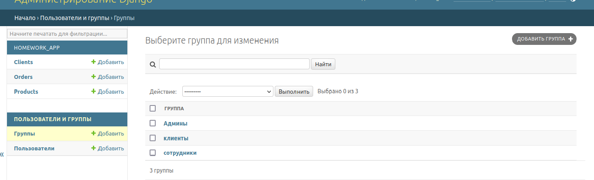
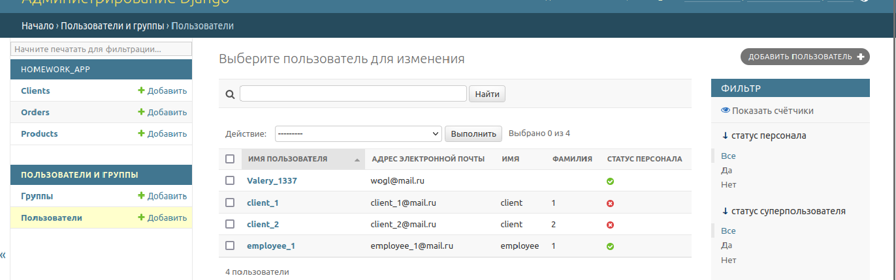
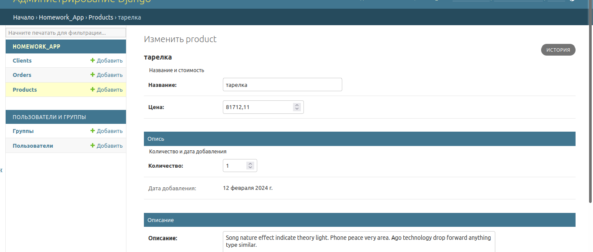
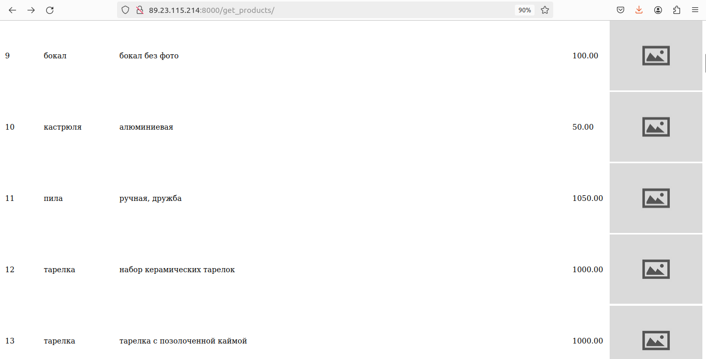

### Домашняя страница, вид:
  
### облачный сервер Timeweb:
  
**Nginx служит в качестве обратного прокси-сервера для Gunicorn, обрабатывая статические файлы и перенаправляя запросы к Gunicorn для обработки Python-кода.**
### gunicorn, gunicorn.socket:
  
### nginx:
      
Домашняя работа 5. Работа с административной панелью  
### URL для входа в административную панель:
http://89.23.115.214:8000/admin/
данные для входа сотрудника:
login - employee_1
password - xtnx$FTZ75qxbtZ
### изменения в models.py: добавлено verbose_name, заменены названия переменных на комфортные именования
### изменения в admin.py - реализованы настройки отображения, фильтры, поля "только для чтения". Actions придумал только 2, для Product
### добавлены группы админы, клиенты, сотрудники
  
### создано несколько пользователей
    

### настроен удобный вид таблиц
  
  
    

### Настроены удобные карточки просмотра/редактирования каждой сущности
  
  
  

Домашняя работа 4. Работа с формами  
Создайте форму для редактирования товаров в базе
данных.  
Появилась форма **ProductForm**  
шаблон - edit_product.html, представление - edit_product(), после нажатия на URL:
http://89.23.115.214:8000/edit_product/8/
  
### После редактирования, без добавления фото, по дефолту изображение заполняется default_image.jpg
  
Измените модель продукта, добавьте поле для хранения
фотографии продукта.  
Создайте форму, которая позволит сохранять фото.  
http://89.23.115.214:8000/edit_product/8/
  
### После редактирования товаров с добавлением фотографии товара
http://89.23.115.214:8000/get_products/
   
### Карточка товара, после добавления фото товара
http://89.23.115.214:8000/get_product/7/
   

Домашняя работа 3. Представления и шаблоны  
Задание 7  
Сделать шаблон для вывода всех заказов клиента и списком товаров, внутри каждого заказа:  
шаблон - orders_client.html, представление - all_orders(), после нажатия на URL:  
http://89.23.115.214:8000/orders/7/  
  
После перехода по ссылке заказа: шаблон - order_info.html, представление show_order(), 
после нажатия на URL или после выбора заказа из предыдущей страницы:  
http://89.23.115.214:8000/show_order/100/  
  
Продолжаем работать с товарами и заказами.  
Создайте шаблон, который выводит список заказанных  
клиентом товаров из всех его заказов с сортировкой по
времени:  
○ за последние 7 дней (неделю)  
○ за последние 30 дней (месяц)  
○ за последние 365 дней (год)  
*Товары в списке не должны повторятся.  
шаблон - order_list.html, представление -  order_list(), пример маршрута:  
http://89.23.115.214:8000/order_list/7/  
Вид после нажатия на URL выше:
  
Для того, чтобы было понятно, что товары не повторяются, добавлен вывод id товара   
не все клиенты в моей базе делали заказы в течении первых 7 дней, создается все рандомно

Домашняя работа 2. Модели  
Созданы модели 'Клиент', 'Товар', 'заказ' с требуемыми для них полями  
Реализованы CRUD функции для этих моделей:  
<pre>Create - расположены в файле homework_app/management/commands/my_command.py  
при выполнении команды  "python3 manage.py my_command" создаётся 10 клиентов с рандомными данными,  
создаётся 10 позиций товаров с рандомными данными, и для каждого клиента создается 1 заказ,   
с рандомным количеством товаров. Товары в заказе располагаются в связующей таблице order.products  </pre>
<pre>Read - в файле homework_app/views.py методы: get_client(), get_product(), get_order(), products_by_order(),  
get_all_clients(), get_all_products(), get_all_orders(). Позволяют через url получить данные клиента,   
данные товара, данные заказа, еще можно получить таблицу всех клиентов или всех товаров или всех заказов.   
также получить таблицу товаров в определенном заказе  </pre>
**Примеры Read запросов:**  
http://89.23.115.214:8000/get_clients/  - таблица клиентов  
http://89.23.115.214:8000/get_client/17/  - карточка клиента  
http://89.23.115.214:8000/get_products/  - таблица товаров  
http://89.23.115.214:8000/get_product/21/  - карточка товара  
http://89.23.115.214:8000/get_orders/  - таблица заказов  
http://89.23.115.214:8000/get_order/37/  - карточка заказа  
http://89.23.115.214:8000/products_by_order/37/  - отдельно товары заказа  
    <pre> Update - в файле homework_app/views.py методы: update_name_client(), update_price_product(),   
add_product_to_order(), remove_product_from_order(). Методы позволяют изменить через url: имя клиента, 
изменить цену определенного товара, также можно добавить товар в имеющийся заказ или удалить товар из заказа.  </pre>
**Примеры Update запросов:**  
http://89.23.115.214:8000/update_order/37/add_product/24/  - добавление товара  
http://89.23.115.214:8000/update_order/37/delete_product/24/  - удаление товара  
http://89.23.115.214:8000/update_product/21/update_price/11111/  - обновление цены  
http://89.23.115.214:8000/update_client/29/update_name/Lotos/  - обновление фио  
    <pre>Delete - в файле homework_app/views.py методы: delete_client(), delete_product(), delete_order().  
Тут все просто, удаляется либо клиент, либо товар, либо заказ  </pre>
    **Примеры delete запросов:**  
http://89.23.115.214:8000/delete_client/26/  - удаление клиента  
http://89.23.115.214:8000/delete_product/53/  - удаление товара  
http://89.23.115.214:8000/delete_order/49/  - удаление заказа  
